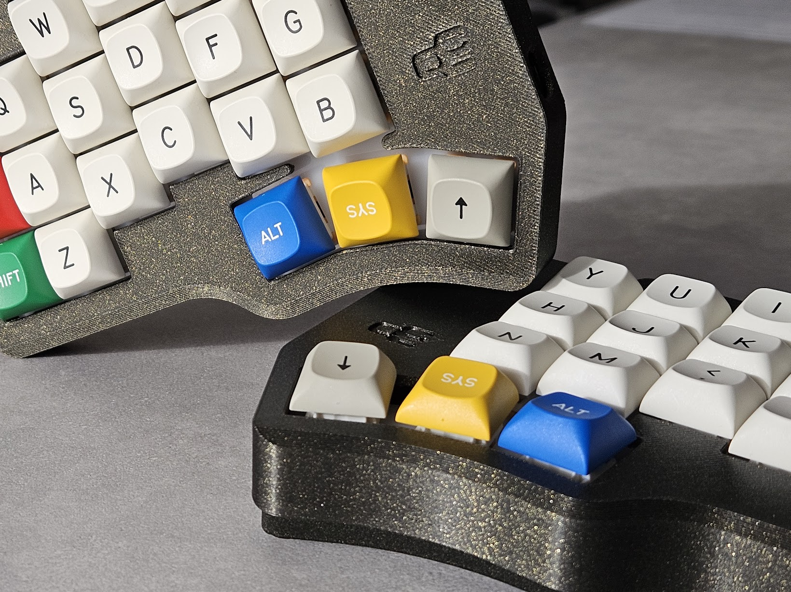
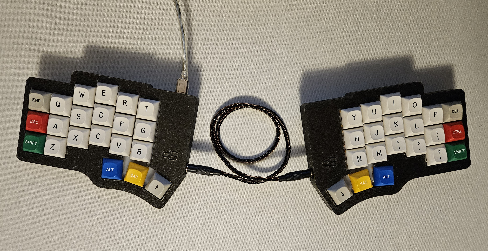
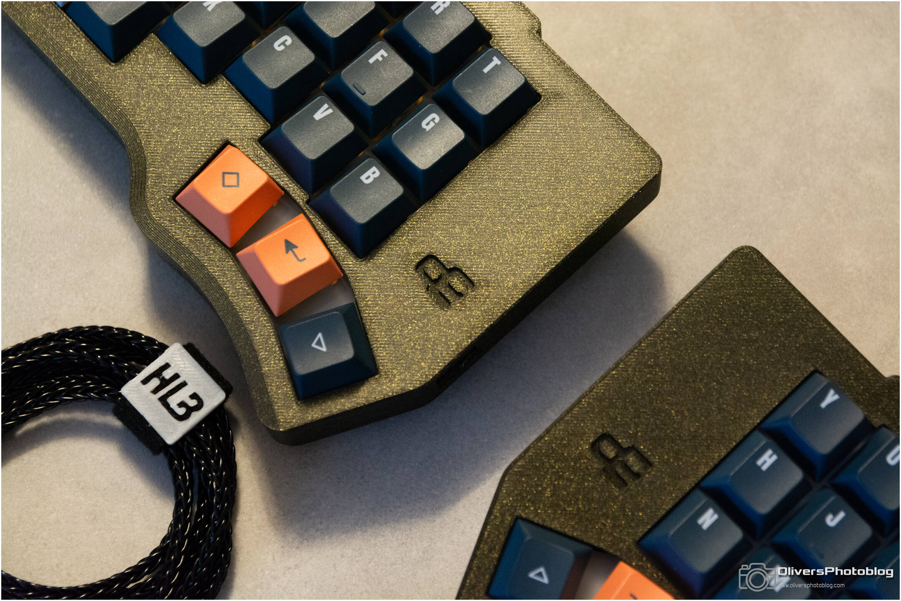
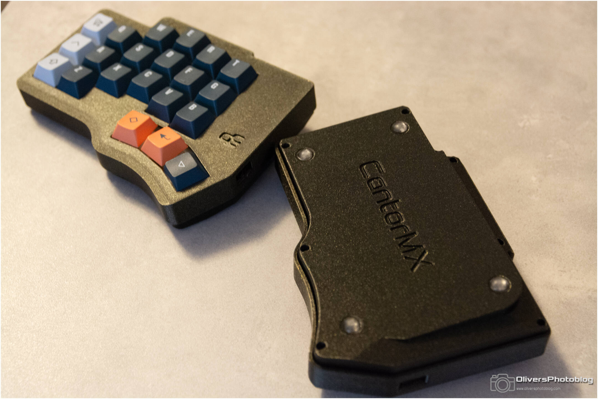
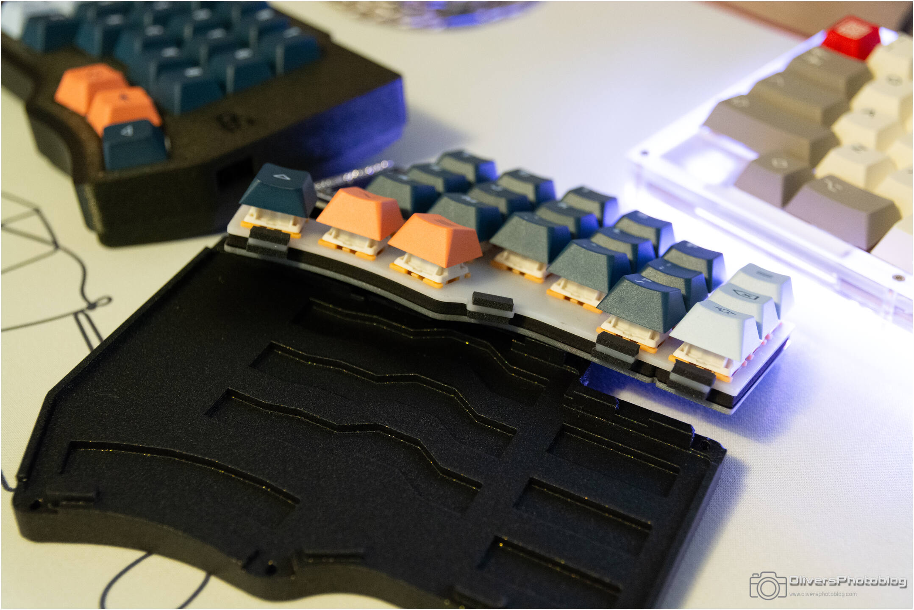

# CantorMx-3DP-case
3DP case for CantorMx split keyboard in 36% and 42% layouts

- Gasket mount
- 5 degrees typing angle for the 42% and 5 degrees tilting angle for the 36%

# Supplies

- 3dp brass inserts https://fr.aliexpress.com/item/1005005776999972.html (M2 x 5mm)
- Gasket 3mm https://fr.aliexpress.com/item/1005005563572310.html (80x4x3MM)
- Screws M2x6mm https://fr.aliexpress.com/item/1005006211548561.html
- TRRS cable https://fr.aliexpress.com/item/1005006954874186.html

# Electronic components for the split

- Original WeActStudio BlackPill F411 8Mhz crystal (latest revision)  https://fr.aliexpress.com/item/1005001456186625.html 
- PCB printed through JLCPB https://github.com/diepala/cantor/releases/tag/mx-rev1.6
- TRRS connectors https://fr.aliexpress.com/item/1005003111662179.html

# Firmware

My firmware supporting BlackPill version is here: [Cantor 2.0 firmware VIAL](https://github.com/H3lli0n/vial-qmk/releases/tag/cantor_v2.0)
